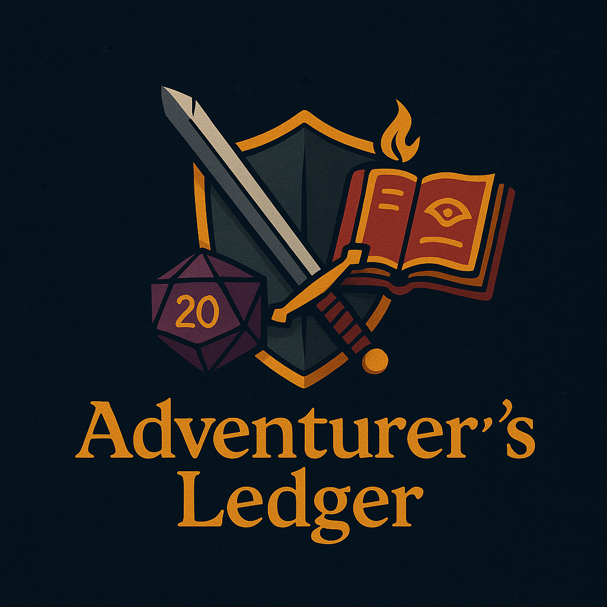
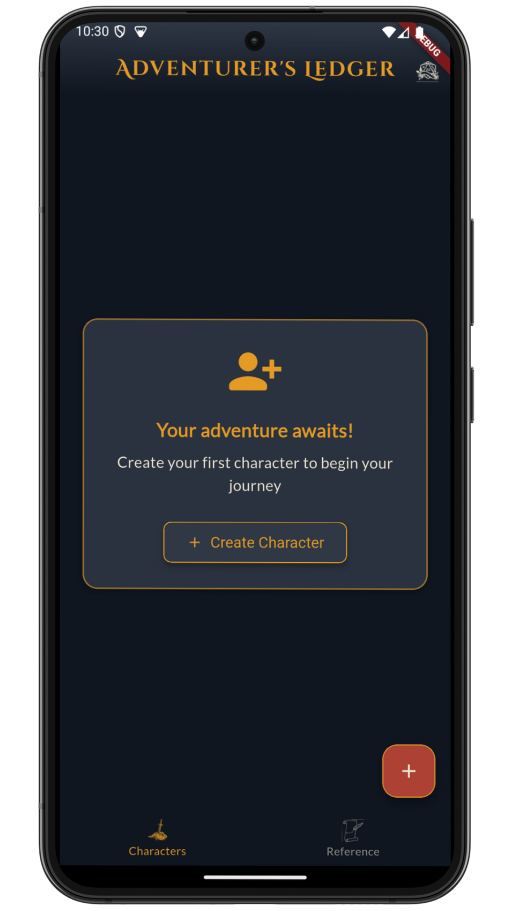
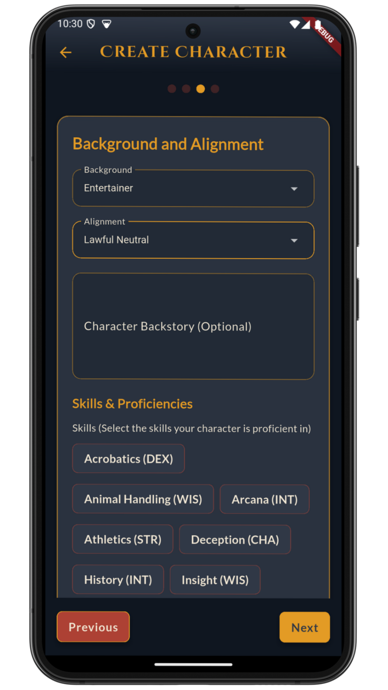
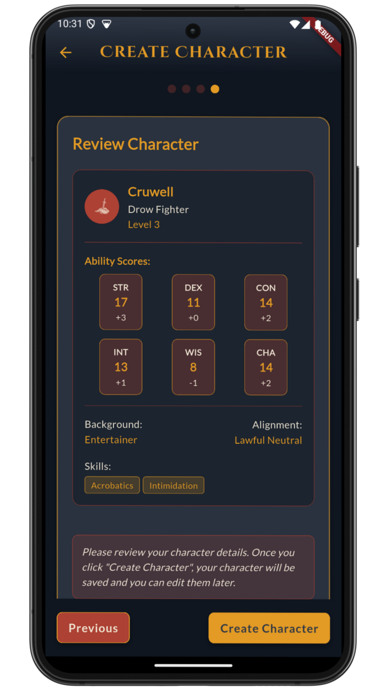
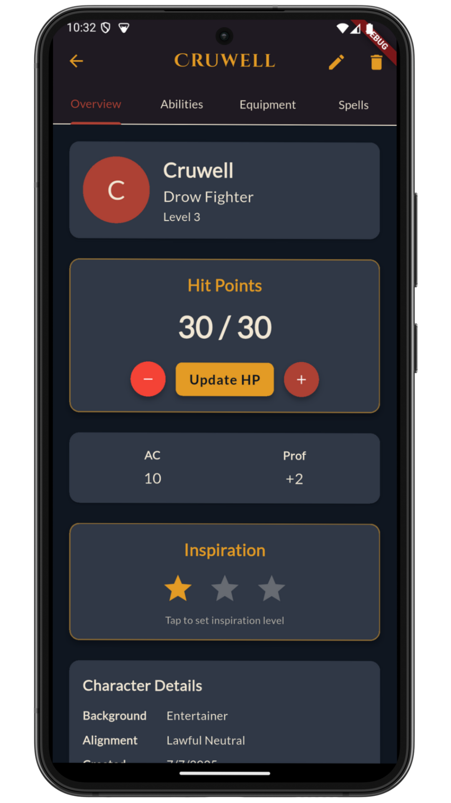
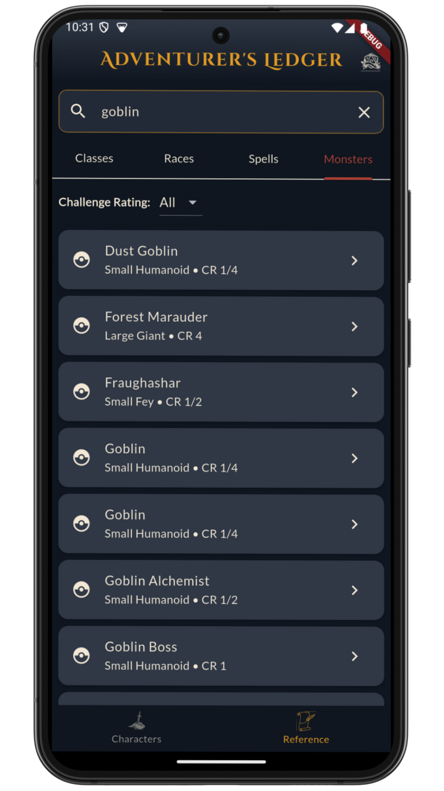
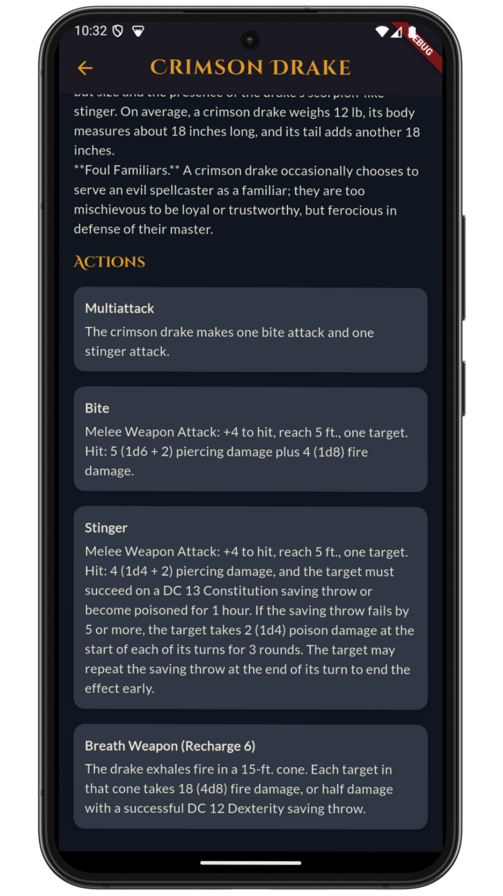
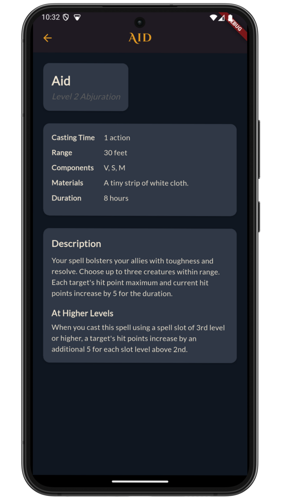
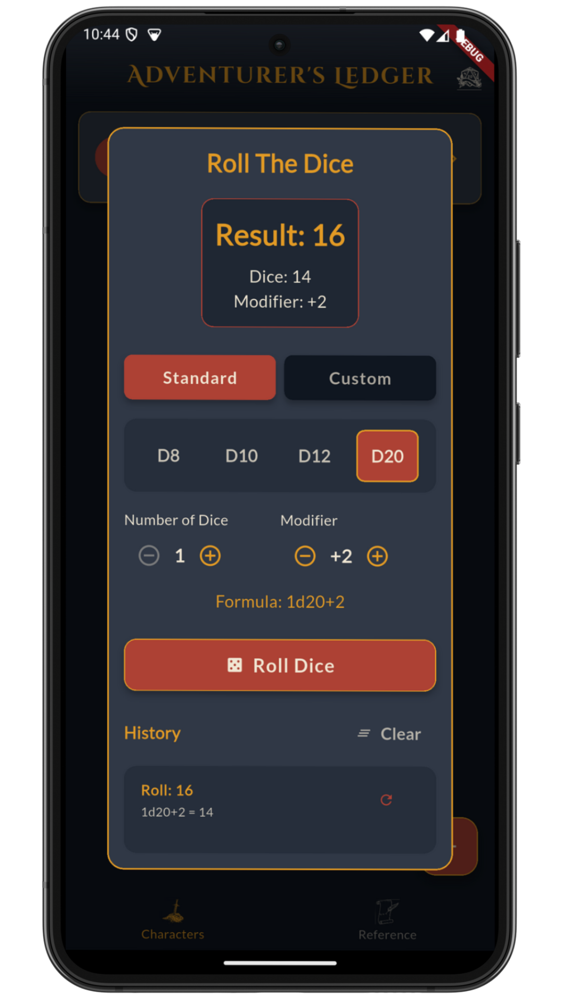

# 🗡️ Adventurer's Ledger (WIP)


<p align="center">
  
</p>

## 📜 Your Digital Companion for Epic Adventures

Adventurer's Ledger is a fantasy-themed mobile application designed to help you manage your characters in Dungeons & Dragons and similar tabletop role-playing games. Easily track your characters' attributes, abilities, equipment, and stories all in one place.

## ✨ Features

- **Character Creation**: Create unique characters with classes, races, and custom attributes
- **Ability Score Tracking**: Dynamically manage all your character stats and skill bonuses
- **Equipment Management**: Comprehensive inventory system for weapons, armor, and magical items
- **Spellbook**: Organize your character's spells and abilities
- **Quick Reference**: Built-in guides for game rules
- **Fantasy Theme**: Unique interface design tailored to the tabletop RPG world

## 🛠️ Technical Specifications

Adventurer's Ledger is built using modern Flutter development practices:

- **MVVM Architecture**: Clean and maintainable code structure
- **Provider**: Efficient state management
- **SQLite & Hive**: Local data storage
- **Connectivity Awareness**: Data synchronization for offline use
- **D&D 5e API Integration**: API connection for reference data
- **Customizable Theming**: User interface suited to the fantasy RPG world
- **Dice Roller**: Integrated dice simulator and results calculator

## 🚀 Installation

1. Install Flutter SDK on your machine (minimum version: 3.7)
2. Clone the repository:
   ```
   git clone https://github.com/berkawaii/adventurers_ledger.git
   ```
3. Install dependencies:
   ```
   flutter pub get
   ```
4. Run the application:
   ```
   flutter run
   ```

## 📱 Screenshots

<p align="center">
  
   
   
   
  
  
  
  
</p>

## 🧙‍♂️ Contributing

We welcome contributions to Adventurer's Ledger! Here's how you can help:

1. Fork this repository
2. Create a new feature branch (`git checkout -b feature/amazing-feature`)
3. Commit your changes (`git commit -m 'Add amazing feature'`)
4. Push to the branch (`git push origin feature/amazing-feature`)
5. Open a Pull Request

## 📄 License

This project is licensed under the MIT License - see the `LICENSE` file for details.

## 🔮 Future Plans

- **Detailed Subclasses**: Warlock pacts, fighter archetypes, and more class-specific features
- **Adventure Journal**: Record your game sessions and keep track of your adventures
- **Party Management**: Track party members and NPCs in your campaign
- **Character Illustrations**: Customizable portraits to visualize your character


---

<p align="center">
  <i>🎲 Adventure awaits you, brave hero! 🎲</i>
</p>
